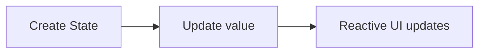
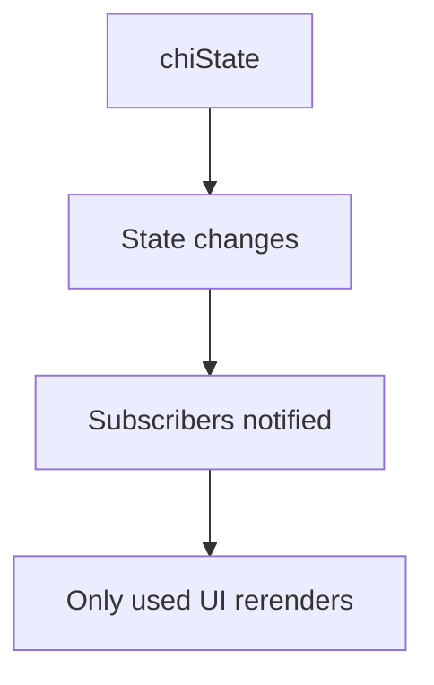
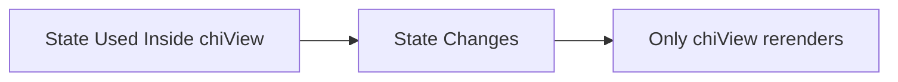
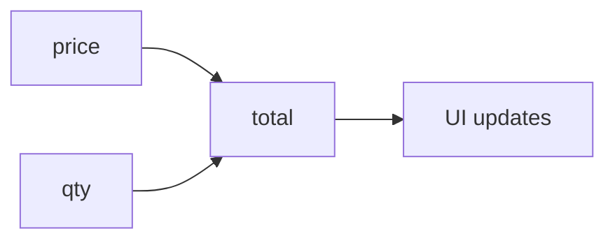
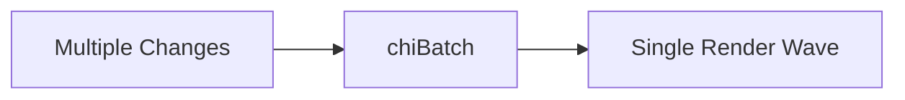
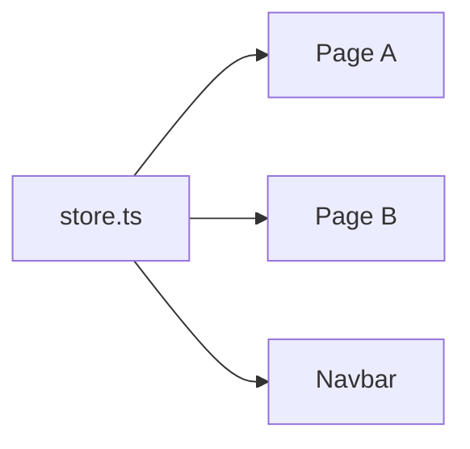

# ⚡ chiState

> ### Ultra-simple reactive state management for React
> 
> **No hooks. No reducers. No providers. No boilerplate.**

----------

# 🚀 Quick Start (5 Seconds)

```tsx
"use client";
import { chiState, Chi } from "chistate";

const count = chiState(0);

export default function App() {
  return (
    <>
      <button onClick={() => count.value++}>+</button>
      <Chi value={count} />
    </>
  );
}

```

✅ Click button → UI updates automatically.

----------



----------

# 📦 Installation

```bash
npm install chistate

```

or

```bash
yarn add chistate

```

----------

# 🧠 What is chiState?

`chiState` is a **fine-grained reactive state engine** for React.

Instead of rerendering large component trees, it updates **only the UI that uses changed state**.

### Why it matters:

-   ⚡ Faster UI
    
-   🧹 Cleaner code
    
-   🎯 Less rerendering
    
-   🧠 Easier mental model
    

----------

# ✨ Core API

```bash
# Create reactive state
`chiState()`
```
```bash
# Render reactive values
`Chi`
```
```bash
# Reactive JSX block
`chiView()`
```
```bash
# Derived state
`chiComputed()`
```
```bash
# Effects / watchers
`chiLog()`
```
```bash
# Group updates
`chiBatch()`
```

----------

# 🏗️ How It Works



----------

# 1️⃣ chiState() → Create State

```tsx
import { chiState } from "chistate";

const count = chiState(0);

```

### Read Value

```tsx
count.value

```

### Update Value

```tsx
count.value++
count.value = 10

```

----------

# 2️⃣ Chi Component → Easiest UI Binding

```tsx
import { chiState, Chi } from "chistate";

const count = chiState(0);

export default function App() {
  return (
    <>
      <button onClick={() => count.value++}>+</button>
      <Chi value={count} />
    </>
  );
}

```

----------

## 🎨 Extra Props

### Custom Tag

```tsx
<Chi value={count} as="h1" />

```

### Class Name

```tsx
<Chi value={count} className="text-xl" />

```

### Fallback

```tsx
const user = chiState(null);
<Chi value={user} fallback="Guest" />

```

### Format

> **Older Version-: // <= 0.1.3 (Avoid)
```bash
<Chi  value={price}  format={(v) =>  `₹${v}`}  />
```

> **Newer  Version-: // 0.2.1
```bash
<Chi  value={price}>
{(v)=>`₹${v}`}
</Chi>
```

#  chiAudio → Simple Music Sysytem Handler. 
```bash
tracks = [{}] or [strings]
const player = chiAudio({playlist:tracks})
  player returns = {
    audio,

    playing,
    loading,
    muted,

    length,
    index,
    current,

    currentTime,
    duration,
    progress,
    volume,
    startTime,
    endTime,

    play,
    pause,
    toggle,

    next,
    prev,

    seekTo,
    seekPercent,

    setVolume,
    mute,
    unmute,

    setIndex,
    destroy,
  };

  USAGE: player.length.value , player.toggle ,player.prev, player.next , player.startTime.value, player.endTime.value, player.seekTo(Number(e.target.value)), player.current.value.image | name | etc.
```

----------

# 3️⃣ chiView() → Reactive JSX Block

Use when UI is more than text.

```tsx
"use client";
import { chiState, chiView } from "chistate";

const count = chiState(0);

export default function App() {
  return chiView(() => (
    <div>
      <button onClick={() => count.value++}>+</button>
      <h1>{count.value}</h1>
    </div>
  ));
}

```

----------



----------

# 🔥 watch Mode

Inline reactive UI without manually writing `chiView`.

```tsx
<Chi
  watch={() => (
    <div>Count: {count.value}</div>
  )}
/>

```

### Great For:

Here are emojis for each UI element with names:

-   🏅 **Badges**
    
-   🔢 **Counters**
    
-   📍 **Status Text**
    
-   🧩 **Mini Widgets**
    
-   ✨ **Inline UI Parts**
    

----------

# 4️⃣ chiComputed() → Derived State

Auto-updating values based on other state.

```tsx
const price = chiState(100);
const qty = chiState(2);

const total = chiComputed(() => price.value * qty.value);

```

----------



----------

### Full Example

```tsx
<Chi value={total} />

```

----------

# 5️⃣ chiLog() → Reactive Effects

Run code whenever used state changes.

```tsx
chiLog(() => {
  console.log(count.value);
});

```

### With Cleanup

```tsx
chiLog(() => {
  const id = setInterval(() => {
    console.log(count.value);
  }, 1000);

  return () => clearInterval(id);
});

```

----------

# 6️⃣ chiBatch() → Group Updates

Many changes → one update wave.

```tsx
chiBatch(() => {
  count.value++;
  user.value = "Alex";
  dark.value = true;
});

```

----------



----------

# 🏠 Local vs 🌍 Global State

----------

## Local Scope (Internal State)

Use inside component or page.

Best for:

>####   📝 **Forms**
    
>####   🪟 **Modals**
    
>####  ⬇️ **Dropdowns**
    
>####   🧩 **Widgets**
    
>####  ⏳ **Temporary UI**

 
```tsx
const open = chiState(false);

```

----------

## Global Scope (External Store)

Use shared state across app.

#### store.ts

```tsx
export const darkMode = chiState(false);
export const cartCount = chiState(0);

```

#### Page.tsx

```tsx
<button onClick={() => darkMode.value = !darkMode.value}>
  Theme
</button>

<Chi value={cartCount} />

```

----------



----------

# 📝 Example Projects

### ✅ Todo App

Features:

-   Add tasks
    
-   Search
    
-   Filters
    
-   Edit task
    
-   Progress bar
    
-   Dark mode
    
-   LocalStorage
    
-   Computed stats
   >#### GITHUB

----------

## 🎮 Tic Tac Toe

Features:

-   Board state
    
-   Winner logic
    
-   Scoreboard
    
-   New round
    
-   Reset all
    >#### GITHUB

----------

# ⚡ Why It Feels Better

Traditional React:

```tsx
const [count, setCount] = useState(0);
setCount(prev => prev + 1);

```

chiState:

```tsx
count.value++

```

Simple. Direct. Clean.

----------

# 📈 Performance Summary

### Stress Tests Showed:

>#### Only affected UI rerenders
    
>#### 100 isolated counters passed
    
>#### 10,000 counters mounted
    
>#### Smooth 60 FPS updates
    
>#### Good cleanup behavior
    
>#### Efficient batching
    

----------


# 🧩 Best Practices

>## Use `Chi`

For simple values.

```tsx
<Chi value={count} />

```

>## Use `chiView`

For sections / layouts.

```tsx
return chiView(() => <Dashboard />);

```

>## Use `chiComputed`

For totals / filtered data.

>## Use `chiBatch`

For grouped updates.

>##  Use Global Store

For shared app state.

----------

# ❌ Avoid

> #####   Mutating arrays directly
    
> #####   Circular computed chains
    
> #####   Huge logic inside render
    

Bad:

```tsx
items.value.push(1)

```

Good:

```tsx
items.value = [...items.value, 1]

```

----------

#  FAQ

### Need Provider?

> ##### No

### Need Context?

> ##### No

### Works with Next.js?

> ##### Yes

### TypeScript Support?

> ##### Yes

----------

## 🏁 Final Example

```tsx
"use client";

import {
  chiState,
  chiComputed,
  Chi
} from "chistate";

const count = chiState(1);

const double = chiComputed(
  () => count.value * 2
);

export default function App() {
  return (
    <div>
      <button onClick={() => count.value++}>
        +
      </button>

      <p>Count: <Chi value={count} /></p>
      <p>Double: <Chi value={double} /></p>
    </div>
  );
}

```

----------

## ❤️ Summary

If you want:

> #####   ⚡ Simpler React state
    
> #####   🎯 Less rerenders
    
> #####   🧼 No boilerplate
    
> #####   🧠 Easy mental model
    
> #####   🚀 Reactive power
    

---

  

### ⚡ Why chistate?

  

> ##### No boilerplate

 >##### No providers

 >##### No reducers

 >##### Just variables

  

---
### ⭐ Support

  

> ##### If you like it, give a ⭐ on [Github!](https://github.com/rohitLovesKrishna/chistate)

### Contributing
> ##### For usage related query feel free to contact "admin@appsitesolutions.in"
##### Made with ❤️ by Rohit Ambawata

----------

# 📄 License

MIT